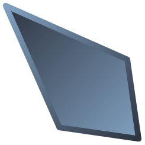

# Hyprmouse

## Control the mouse with your keyboard using Vim Motions
A highly customizeable Hyprland overlay that enables you to never move your hands away from the keyboard.

## Requirements
- [Hyprland](https://hyprland.org/)
- [ydotool](https://github.com/ReimuNotMoe/ydotool)(make sure to start the ydotoold process or my app won't work)
- [Cairo](https://pycairo.readthedocs.io/en/latest/)
- [GTK3](https://docs.gtk.org/gtk3/)
- [GTK Layer Shell](https://github.com/wmww/gtk-layer-shell)
- [PyGObject](https://pypi.org/project/PyGObject/)

## Binds
Custom keybinds will be supported shortly
- <b>DEL</b> - Force quit the app
- <b>ESC</b> - Return to the initial position and close the overlay
- <b>Return</b> - Confirm the new position and close the overlay
- <b>0</b>-<b>9</b> - Enter a digit
- <b>B</b>/<b>b</b>/<b>Backspace</b> - Delete a digit
- <b>+</b>/<b>=</b> - Switch to positive direction
- <b>-</b>/<b>=</b> - Switch to negative direction
- <b>I</b>/<b>i</b> - Invert direction
- <b>X</b>/<b>x</b> - Jump on the X axis in the set direction
- <b>Y</b>/<b>y</b> - Jump on the Y axis in the set direction
- <b>R</b>/<b>r</b> - Move to the center of the screen
- <b>D</b>/<b>d</b> - Reset delta
- <b>U</b>/<b>u</b> - Undo the last position change
- <b>H</b>/<b>h</b>/<b>←</b> - Move left
- <b>J</b>/<b>j</b>/<b>↓</b> - Move down
- <b>K</b>/<b>k</b>/<b>↑</b> - Move up
- <b>l</b>/<b>l</b>/<b>→</b> - Move right

## Config
Config file should be located in `~/.config/hypr/hyprmouse.conf`  
Some of the things to keep in mind:
- All of the following values are valid for bools: `True`/`true`, `False`/`false`
- All the colors must be provided as HEX values, # is not required
- Keep the fps relatively low, it can have a huge impact on the performance
- Spaces don't matter, `key=value` is just as fine as `key = value`
- Font will be retrieved from your gtk settings but you can overwrite it and adjust the size

 

<b>Example</b> provided below contains all the options
- `show_ui = True` - <b>bool</b> - Will the UI be shown
- `show_background = True` - <b>bool</b> - Will the background be shown
- `show_grid = True` - <b>bool</b> - Will the grid be shown
- `show_dots = True` - <b>bool</b> - Will the dots be shown
- `show_numbers = True` - <b>bool</b> - Will the numbers be shown
- `follow_mouse = False` - <b>bool</b> - Will the UI be relative to the cursor
- `default_delta = 10` - <b>int</b> - Default movement delta
- `reset_on_jump = False` - <b>bool</b> - Whether to reset dir and delta when jumping
- `set_dir_on_move = True` - <b>bool</b> - Whether to set dir when moving
- `toggle_dir = True` - <b>bool</b> - Pressing the same sign twice will toggle the direction
- `reset_delta_to_default = True` - <b>bool</b> - Whether to reset delta to the `default_delta` or 0
- `clear_delta_on_initial_input = True` - <b>bool</b> - Whether to clear delta on initial number input
- `clear_delta_on_input_after_move = True` - <b>bool</b> - Whether to clear delta on number input after moving
- `reset_pos_on_start = False` - <b>bool</b> - Will the cursor be moved to the middle on start
- `format = x, y` - <b>string</b> - How will the coordinates be formatted
- `font = Cascadia Code` - <b>string</b> - Font that the UI will use
- `font_size = 30` - <b>int</b> - Font size
- `background_color = #000000` - <b>string</b> - Color of the background
- `grid_color = #5E81AC` - <b>string</b> - Color of the grid
- `dot_color = #EBCB8B` - <b>string</b> - Color of dots
- `text_color = #ECEFF4` - <b>string</b> - Color of the text
- `text_outline_color = #2E3440` - <b>string</b> - Color of the text outline
- `fps = 60` - <b>int</b> - Framerate at which the app will be redrawn
- `background_opacity = 0.5` - <b>float</b> - Opacity of the background
- `spacing = 400` - <b>int</b> - Spacing between grid lines
- `grid_thickness = 1` - <b>float</b> - Thickness of grid lines
- `dot_radius = 3` - <b>float</b> - Radius of dots
- `text_outline_thickness = 1` - <b>float</b> - Thickness of the text outline(I would advise against going above 2)
- `text_y_offset = 0` - <b>float</b> - Y offset applied to text

## Thanks
### - [Vaxry](https://github.com/vaxerski)
For making [Hyprland](https://hyprland.org/) and majority of tools this app is based on - <i>"[the fuck is an overlay](https://discord.com/channels/961691461554950145/1070436481912549497/1214007552929570907)"</i>
### - [outfoxxed](https://github.com/outfoxxed)
For suggesting an approach for making an overlay and pointing me in the right direction
### - PoutineBurgerMan
For letting me know that hyprctl cursorpos exists
